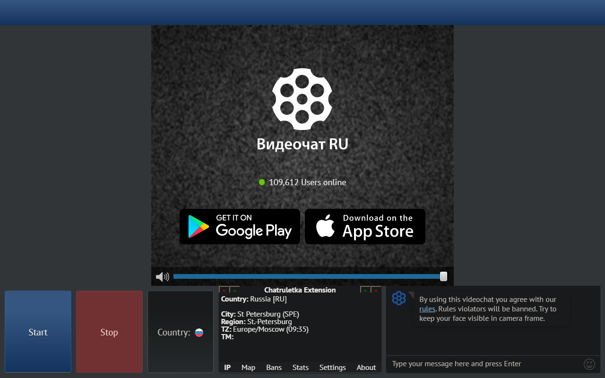

> v1.7.0 update brings typescript rewrite, support for firefox, omegle and 44 sites of the global Chatruletka/ometv platform (like https://ome.chat)!  

> Unfortunately the v1.7.0 update for Chrome Web Store is not available yet due to unexpected problems with the store policy, which I am currently trying to solve, but due to slow moderation it may take longer than expected.  

> You can check v1.7.0 in the Firefox, which just got Firefox support:  
> https://addons.mozilla.org/firefox/addon/videochat-extension-ip-locator

<h1 align="center">Videochat Extension (Чат Рулетное Расширение)</h1>

 

 

Videochat Extension (Chatruletka Extension) is an independent open-source project that extends the functionality of your favorite online video chats.

It currently supports 55 video chat sites belonging to six platforms: Chatruletka (Чат Рулетка), Ome.tv, Minichat, Chatrulez, Omegle (IP Locator & Dark Mode only) and Coomeet Free (bot recognition only).

[more screens](screens.md)  
## Installation from store
<table><tr><th></th><th></th><th></th></tr><tr><th></th><th></th><th></th></tr><tr><th></th><th></th><th></th></tr></table>

## Building from source
1. git clone https://github.com/qrlk/videochat-extension
2. npm i
3. npm run cross-dev
4. manually load into your browser from 'webpack-builds'

## Features
* **IP Locator**
  * uses the ip geolocation service to determine the approximate location and whether the stranger's using a mobile/vpn/tor connection
* **map**
  * IP Locator's data is displayed on a world map
* **auto-skip of certain genders**
  * ai-powered client-side gender recognition
  * possibility to add a stranger to the blacklist if he was skipped because of gender
  * statistics on the number of men/women encountered
* **search for specific cities/regions**
  * auto-skip if the stranger is not from a list of cities/regions you have specified
* **iknowwhatyoudownload**
  * allows to open a window with a list of torrents potentially downloaded by a stranger
  * it's a great way to talk to a stranger about their tastes in games, music, movies
  * does not work for mobile/vpn/tor connections
  * not useful in countries where torrents are illegal
* **screenshot**
  * the ability to take screenshot from a stranger's camera
  * the ability to take screenshot from your own camera
* **picture-in-picture**
  * ability to activate PiP mode on remote/local camera
  * this way you can see people while you are doing other things on your PC
* **local hotkeys**
  * use the keyboard arrows to skip/skip+blacklist/stop/report
* **global hotkeys**
  * browser-level hotkeys to skip/skip+blacklist/stop
  * browser-level hotkeys to make remote/local screenshot
  * browser-level hotkey to switch from the current tab to the chat tab and back
* **automation**
  * auto-skip strangers that take more than 4 seconds to connect
  * auto-skip if you were looking for someone from X country but the videochat found you someone from Y country
  * automatically close 'make yourself visible'
* **blacklist**
  * ability to blacklist the stranger's IP to auto-skip him the next time you meet
  * option not to add mobile IPs to the blacklist due to their temporary nature
  * statistics on how many blacklisted IPs you've encountered again
* **statistics**
  * counts the number of people you've met in video chat
  * counts how much time you spent in video chat
  * counts various statistics for other modules such as blacklist / gender skipping
* **interface tweaks**
  * dark mode
  * hide/show logo, banner, header, watermark
  * ability to cancel camera reflection (not on all platforms)
  * ability to disable cropping stranger's video (not on all platforms)
  * ability to hide your own camera to make conversation more natural
* **streamer mode**
  * a set of features to help streamers to combat nsfw on streams and much more
  * ability to hide a stranger's camera image with a blur or custom picture/gif and look at it in picture-in-picture mode to check for nsfw
  * optional auto blurring/hiding when starting a new conversation
  * hotkey to mute/blur/cover a stranger
  * this mode is in alfa version, if you have feedback please contact the developer in the project's discord
* **other less important QoL-features**

**Not all extension features are available on all platforms.**

## Supported chats
### Chatruletka (full support):
* **https://chatruletka.com**
* **https://chatruletka.ua**
* **https://ruletka.chat**
* **https://videochatar.com**
* **https://videochatau.com**
* **https://videochatbr.com**
* **https://brvideochat.com**
* **https://videochatca.com**
* **https://videochatde.com**
* **https://videochatfr.com**
* **https://frvideochat.com**
* **https://roulettefrancais.com**
* **https://videochatit.com**
* **https://videochatjp.com**
* **https://videochatmx.com**
* **https://videochatnl.com**
* **https://videochatpl.com**
* **https://videochatpt.com**
* **https://videochatru.com**
* **https://videochatuk.com**
* **https://videochatus.com**
* **https://roulette-espanol.com**
* **https://ruletaespanol.com**
* **https://ruletkavideochat.com**
* **https://turkishvideochat.com**

### Ome.tv (full support):
* **https://ome.tv**
* **https://ome.chat**
* **https://camki.com**
* **https://chatalternative.com**
* **https://chatrooms.chat**
* **https://chatrooms.pro**
* **https://chat-brasil.com**
* **https://chat-de.com**
* **https://chat-fr.com**
* **https://chat-nl.com**
* **https://chat-pl.com**
* **https://chat-pt.com**
* **https://chatgenerator.com**
* **https://prostochat.com**
* **https://stickam.chat**
* **https://chatbizar.com**
* **https://ukr.chat**
* **https://cafeclub.ua**
* **https://indiavideochat.com**
* **https://webcamchatta.com**

### Minichat (full support):
* **https://minichat.com**

### Chatrulez (full support):
* **https://chatrulez.ru**
* **https://videochatruletka.com**
* **https://videochatruletka.ru**

### Omegle (IP Locator & Dark Mode):
* **https://www.omegle.com**
* **https://www.omegle.tv**

### Coomeet Free (bot recognition & interface tweaks):
* **https://free.coomeet.com**
* **https://rusvideochat.ru**
* **https://video-roulette24.ru**
* **https://chatroulette.msk.ru**

## Please note
* This extension is intended for real users who come to chat without destructive / hostile intentions.  
* All PRs with functionality that can harm users of the platform, such as bypassing the ban on virtual cameras to scare people with screamers, will be rejected.
